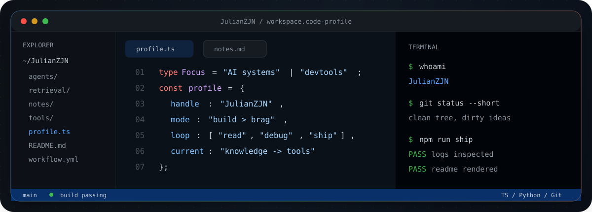
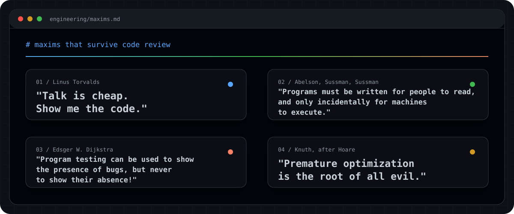

  

  

 

  

 

### `./profile --inspect`

<table>
  <tr>
    <td width="22%"><code>focus</code></td>
    <td>AI systems, retrieval, developer tooling, automation, and knowledge workflows.</td>
  </tr>
  <tr>
    <td><code>style</code></td>
    <td>Read the code, reproduce the state, inspect the logs, then change the smallest useful thing.</td>
  </tr>
  <tr>
    <td><code>current()</code></td>
    <td>Building practical systems that connect study, notes, code, and execution.</td>
  </tr>
  <tr>
    <td><code>principle</code></td>
    <td>Less theater. More working software.</td>
  </tr>
</table>

 

### `engineering/maxims.md`

  

  
Quote sources

  - Linus Torvalds: commonly cited from a [linux-kernel mailing list message](https://lkml.org/lkml/2000/8/25/132), 25 August 2000.
  - Abelson, Sussman, and Sussman: cited by [MIT Libraries](https://libraries.mit.edu/150books/2011/05/11/1985/) from the preface of <em>Structure and Interpretation of Computer Programs</em>.
  - Edsger W. Dijkstra: from the E.W. Dijkstra Archive, ["Structured Programming" (EWD268)](https://www.cs.utexas.edu/~EWD/transcriptions/EWD02xx/EWD268.html).
  - Donald Knuth / C.A.R. Hoare: discussed by [ACM Ubiquity](https://ubiquity.acm.org/article.cfm?id=1147993) in context of premature optimization.

 

### `toolchain`

  

 

### `github/telemetry`

  

 

  
  

 

### `contribution/trace`

  <picture>
    <source media="(prefers-color-scheme: dark)" srcset="https://raw.githubusercontent.com/JulianZJN/JulianZJN/output/github-snake-dark.svg" />
    <source media="(prefers-color-scheme: light)" srcset="https://raw.githubusercontent.com/JulianZJN/JulianZJN/output/github-snake.svg" />
    
  </picture>

 

  <code>ship > polish > repeat</code>

