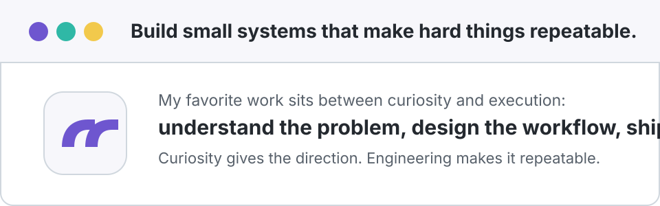

  

  

 

  

### About Me

<table align="center">
  <tr>
    <td>🎓</td>
    <td>Student and builder working across AI, code, and knowledge systems.</td>
  </tr>
  <tr>
    <td>🌱</td>
    <td>Learning AI systems, software engineering, automation, and knowledge tools.</td>
  </tr>
  <tr>
    <td>🧠</td>
    <td>Interested in LLM agents, retrieval, developer tools, and practical productivity systems.</td>
  </tr>
  <tr>
    <td>🛠️</td>
    <td>I like turning scattered ideas into small, reliable tools.</td>
  </tr>
  <tr>
    <td>✍️</td>
    <td>Writing down experiments, lessons, and useful projects as I go.</td>
  </tr>
</table>

 

### Notes & Musings

  

 

### Tech Stack

  

 

### My GitHub

  

 

  
  

 

### Interesting Things

  <picture>
    <source media="(prefers-color-scheme: dark)" srcset="https://raw.githubusercontent.com/JulianZJN/JulianZJN/output/github-snake-dark.svg" />
    <source media="(prefers-color-scheme: light)" srcset="https://raw.githubusercontent.com/JulianZJN/JulianZJN/output/github-snake.svg" />
    
  </picture>

 

  Designed to be simple, personal, and easy to keep fresh.

